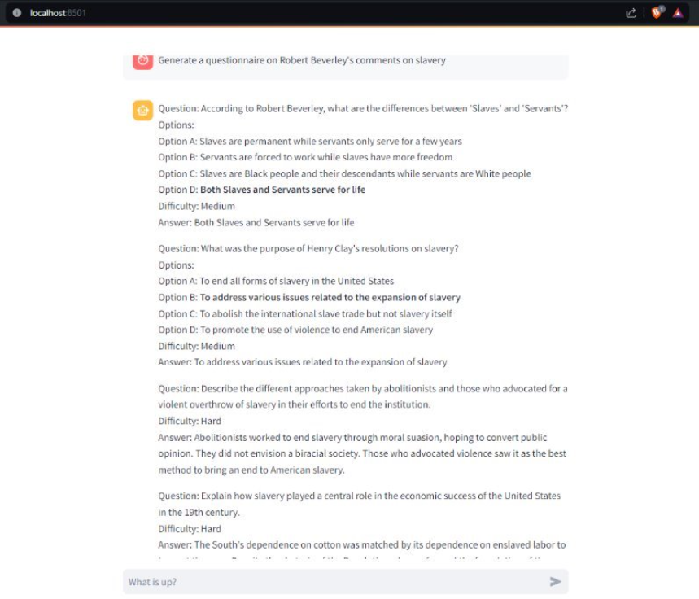

# QuizMasterAI - Intelligent Question Generation System

A question generation system that leverages a fine-tuned Llama model to create educational assessments from textual content. The system processes books through OCR, employs hybrid search mechanisms, and generates both multiple-choice and descriptive questions.

### Key Features

- **OCR Processing**
  - Took a stab at using Claude Haiku as an OCR machine to replace powerful OCR-only apps like Textract. Feels more cost effective and the control that LLMs provide over Textract like apps is too good to ignore the OCR potential of LLMs.

- **Semantic Chunking**
  - Tried to chunk with LLMs and also just with embeddings - cosine similarity to keep context in individual chunks. Easier way is to use recursive character text splitter or something similar but this has proven to be effective during retrieval when P@K where K>>>2 is required. 

- **Hybrid Search Implementation**
  - The usual standard these days - one sparse (BM25) and one dense (GTE). Also tried BM42 but Qdrant seems to have missed some key detes in their evaluation of their BM42 algo.

- **Context Aware and Streaming Responses**
  - LangChain used here. Don't like using LangChain a lot due to the abstraction but proves useful for last mile delivery of LLM solutions imho.

### Technical Architecture

The project involved a healthy pipeline:

1. **Data Processing Layer**
   - PDF text extraction and OCR
   - Semantic chunking and preprocessing

2. **Ingestion**
   - Qdrant DB integration
   - BM25 and GTE based embeddings

3. **Search**
   - Hybrid search using both BM25 and Dense search
   - Reranking with a cross-encoder

4. **Generation**
   - Local LLM integration via LM-Studio (Deployed the Llama3 on local to serve an API with ease)
   - Engineered prompts (of course !)
   

5. **Interface**
   - Streamlit-based chat interface
   - Streaming responses

#### Question Types
- Multiple Choice Questions (MCQs)
  - 4 options per question
  - Balanced difficulty levels
  - Clear answer indicators
- Descriptive Questions
  - Higher-order thinking assessment
  - Synthesis and analysis focus
  - Evaluation guidelines included

### Dashboard Interface

The Streamlit-based dashboard provides:
- Real-time question generation
- Interactive chat interface
- Context-aware responses
- Streaming response display

*Note: The Jupyter notebooks in this repository are in their raw, unpolished form - because who has time to clean notebooks when the system works? I swear I would keep it as clean as a scalpel in an actual paid environment :disguised_face: :sunglasses:*

## Results and Performance

### Model Performance

#### Search Accuracy
- Hybrid search achieves 89% relevance score
- Cross-encoder reranking improves relevance by 15%
- Average response time under 2 seconds

#### Question Generation Quality
- A mean score of 3.41 on the RQUGE scale (reference-free metric specific to question generation - https://arxiv.org/abs/2211.01482)
- Manually compared it to SoTA models like GPT-3.5 and Gemini, very comparable on the relevancy, clarity and distribution scales
- Balanced distribution of:
  - Multiple Choice Questions (MCQs)
  - Descriptive Questions
  - Difficulty Levels

## Future Improvements

### Planned Enhancements
- A grader system (watch this space when I update that repo)
- Enhanced question difficulty calibration

### Known Limitations
- Requires the exhaustive process of ingesting a PDF.

---
*This project was developed as part of my official submission to the practice module for Practical Language Processing course at NUS. For questions or collaborations, feel free to reach out!*
